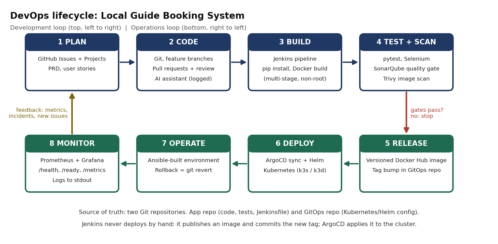

# Task 2: Agile Planning and DevOps Workflow

Student: Mohammad Equaan Kacchi | Roll No: 67 | ID: 23102A0073 | BE-VII Division A

Project: Local Guide Booking System, DevSecOps CI/CD on Kubernetes

Date completed: TODO(student): fill in after the GitHub Projects board exists and is screenshotted. Draft v0.1 prepared 28-09-2026.

## 1. Objective

Original task text from the course sheet:

> Agile Planning and DevOps Workflow: Create user stories and acceptance criteria for the Local Guide Booking System. Prepare a product backlog, 15-Task Kanban/Scrum plan, Definition of Done and a DevOps lifecycle diagram from development to operations.
>
> Deliverable: Backlog, task board, sprint plan, Definition of Done and DevOps workflow diagram.

## 2. Changes from the original spec

| Original | What I did instead | Why |
|-----------|-----------|-----------|
| Kanban or Scrum plan | Scrum-style sprints (three one-week sprints) with a Kanban board that has work-in-progress limits | Sprints give deadlines; the board makes flow visible for a solo developer |
| Lifecycle diagram from development to operations | Same, extended with the GitOps hand-off and quality gates | Reflects Deviations Register D3, D6 and D7 |
| User stories for the application | Application stories plus three enabler stories for operations | Health checks, metrics and seed data are needed by later tasks |

## 3. Tools and versions

| Tool | Version | Purpose |
|---|---|---|
| GitHub Issues and GitHub Projects | current | Backlog and Kanban board |
| Markdown | not applicable | User stories and plan kept in the repository |
| Python with matplotlib | 3.x | Generates the lifecycle diagram (scripts/make_lifecycle_diagram.py) |

## 4. Implementation steps

### 4.1 Roles used in the stories

Traveler, Guide and Visitor, as defined in docs/PRD.md section 2. Operator is used for enabler stories.

### 4.2 User stories and acceptance criteria

Format: "As a role, I want goal so that benefit." Acceptance criteria use Given, When, Then. Requirement ids refer to docs/PRD.md.

Accounts

US-01 Register (FR-01, FR-02). As a visitor, I want to register as a traveler or guide so that I can use the system in the right role.
- Given the register page, when I submit a valid name, email, password and role, then my account is created and I am logged in.
- Given an email that already exists in any letter case, when I register, then I see an error and no second account is created.
- Given the role guide and an empty city, when I submit, then the form is rejected with a message about the city.

US-02 Log in and out (FR-03, FR-04). As a registered user, I want to log in and out so that my bookings stay private.
- Given valid credentials, when I log in, then I see my name in the navigation and links that match my role.
- Given a wrong password or unknown email, when I log in, then I see one generic error message.
- Given I am logged in, when I press Logout, then my session ends and login and register links appear.

Slots

US-03 Publish a slot (FR-05, BR-01 to BR-03). As a guide, I want to publish availability slots so that travelers can book my time.
- Given a future start and an end after the start with a duration of 30 minutes to 12 hours, when I submit, then the slot is created.
- Given a slot that overlaps one of my active slots, when I submit, then it is rejected with a clear message.
- Given a start time in the past, when I submit, then it is rejected.

US-04 Manage my slots (FR-06, FR-07). As a guide, I want to see and deactivate my slots so that my schedule stays accurate.
- Given several slots, when I open My Slots, then each shows a status: available, booked, inactive or past.
- Given a slot with only pending requests, when I deactivate it, then it becomes inactive and the pending requests are cancelled by the system.
- Given a slot with a confirmed booking, when I try to deactivate it, then I am told to cancel the booking first.

US-05 Browse slots (FR-08). As anyone, I want to browse available slots and filter them by city and date so that I can find a guide quickly.
- Given available, booked, inactive and past slots, when I open the list, then only active future slots without a confirmed booking appear, earliest first.
- Given a city filter, when I apply it, then only slots of guides in that city appear, ignoring letter case.
- Given no match, when I filter, then an empty-state message is shown.

US-06 View slot details (FR-09). As anyone, I want to open a slot so that I can see the guide, time and price before requesting.
- Given a slot, when I open its page, then I see guide name, city, bio, time range and price.
- Given a slot that is no longer available, when I open it, then the page says so and shows no booking button.

Bookings

US-07 Request a booking (FR-10, BR-05, BR-06). As a traveler, I want to request a slot with an optional note so that the guide can decide.
- Given an available slot, when I submit a request, then a booking with status PENDING is created.
- Given I already have an active booking on that slot, when I request again, then it is rejected.
- Given a slot that has started, when I request, then it is rejected.

US-08 Confirm a booking (FR-11). As a guide, I want to confirm one request so that the traveler knows the time is theirs.
- Given a pending booking on my slot, when I confirm, then it becomes CONFIRMED and all other pending bookings on that slot become CANCELLED by the system.
- Given a booking on another guide's slot, when I try to confirm it, then I get a not-found response.

US-09 Cancel as traveler (FR-12, FR-15). As a traveler, I want to cancel my booking so that the guide can offer the time to someone else.
- Given my PENDING or CONFIRMED booking before the slot starts, when I cancel with an optional reason, then it becomes CANCELLED.
- Given I cancelled a CONFIRMED booking, when anyone browses slots, then that slot is available again.

US-10 Cancel as guide (FR-12). As a guide, I want to cancel a booking on my slot when my plans change so that the traveler is told promptly.
- Given a PENDING or CONFIRMED booking on my slot, when I cancel, then it becomes CANCELLED and the timeline records me as the actor.

US-11 Track status (FR-13, FR-14). As a traveler or guide, I want to see the status and history of a booking so that I always know where it stands.
- Given my bookings, when I open My Bookings, then I see them newest first with their current status.
- Given a booking, when I open its page, then a timeline lists every transition with actor and time.
- Given someone else's booking, when I open its address, then I get a not-found response.

US-12 No double booking (BR-04). As the system, I must never hold two confirmed bookings for one slot so that guides are never double-booked.
- Given a slot with a confirmed booking, when any code path tries to confirm a second one, then the database rejects it.

Enabler stories

EN-01 Health and readiness (FR-16). As an operator, I want /health and /ready endpoints so that Kubernetes can restart or hold traffic correctly.
- Given the app is running, when I call /health, then I get HTTP 200 without touching the database.
- Given the database is unreachable, when I call /ready, then I get HTTP 503.

EN-02 Metrics (FR-16). As an operator, I want a /metrics endpoint so that Prometheus and Grafana can show request rate, latency and booking transitions.
- Given traffic, when I call /metrics, then the required metric names in PRD section 10 are present.

EN-03 Demo data (FR-17). As a developer, I want an idempotent seed script so that demos and tests start from a known state.
- Given an empty database, when I run the seed script twice, then the row counts after the second run equal the first.

### 4.3 Product backlog

Priority uses MoSCoW (Must, Should, Could). Points are relative effort on the scale 1, 2, 3, 5, 8 for a solo developer working with an AI assistant. Sprint numbers refer to section 4.5. Work items B-xx are defined in docs/TASKS.md.

| ID | Story | Priority | Points | Sprint | Work item |
|--|------------------|--|--|--|--|
| US-01 | Register | Must | 3 | 1 | B-02 |
| US-02 | Log in and out | Must | 2 | 1 | B-02 |
| US-03 | Publish a slot | Must | 3 | 1 | B-03 |
| US-04 | Manage my slots | Must | 2 | 1 | B-03 |
| US-05 | Browse slots | Must | 3 | 1 | B-04 |
| US-06 | View slot details | Must | 1 | 1 | B-04 |
| US-07 | Request a booking | Must | 3 | 1 | B-05 |
| US-08 | Confirm a booking | Must | 3 | 1 | B-05 |
| US-09 | Cancel as traveler | Must | 2 | 1 | B-05 |
| US-10 | Cancel as guide | Must | 1 | 1 | B-05 |
| US-11 | Track status | Must | 3 | 1 | B-06 |
| US-12 | No double booking | Must | 2 | 1 | B-01 |
| EN-01 | Health and readiness | Must | 1 | 1 | B-00 |
| EN-02 | Metrics | Must | 2 | 1 | B-07 |
| EN-03 | Demo data | Should | 1 | 1 | B-01 |
| P-01 | JSON slots endpoint | Should | 1 | 1 | B-04 |
| P-02 | Gauge of bookings by status | Could | 1 | 1 | B-07 |
| T-07 to T-12 | Pipeline stories: CI, pipeline as code, Selenium gate, quality gates, image, registry | Must | 21 | 2 | Tasks 7 to 12 |
| T-13 to T-15 | Provisioning, GitOps, rollback, dashboards, final report | Must | 13 | 3 | Tasks 13 to 15 |

Total planned effort is about 68 points over three sprints. Velocity is unknown, so the plan is re-estimated at the end of each sprint.

### 4.4 Kanban board

The board is a GitHub Projects board attached to the app repository. Every backlog item is a GitHub issue.

| Column | Meaning | Work-in-progress limit |
|---|---|---|
| Backlog | Written and prioritised, not yet ready | none |
| Ready | Meets the Definition of Ready | none |
| In Progress | Being worked on now | 2 |
| In Review | Pull request open, review pending | 2 |
| Done | Merged, tested, documented with evidence | none |

Labels: task, bug, enabler, docs, P1-must, P2-should, P3-could. Each pull request links its issue with "Closes #number". Setup steps: create the project, add the five columns, create one issue per work item and per pipeline task, add all issues to the board, then screenshot the board at the start and end of every sprint.

### 4.5 Sprint plan and 15-task plan

Assumption: about 3 to 4 productive hours per day. Adjust after Sprint 1. Days are counted from the start date (D1 to D21).

| Sprint | Days | Goal | Course tasks |
|---|---|---|---|
| 1 | D1 to D7 | Working MVP in GitHub with reviewed pull requests and tag v0.1.0 | 1 to 6 |
| 2 | D8 to D14 | Every commit is built, tested, scanned and shipped as an image | 7 to 12 |
| 3 | D15 to D21 | Reproducible environment, GitOps deployment, dashboards, final report and viva preparation | 13 to 15 |

Task plan

| Task | Days | Depends on | Output | Main risk |
|---|---|---|---|---|
| 1 Problem and scope | D1 | none | Task 1 report with interview evidence | Skipping real validation |
| 2 Agile plan | D1 to D2 | 1 | Board, backlog, diagram, this report | Board not screenshotted early |
| 3 Architecture and setup | D2 to D3 | 1, 2 | Architecture diagram, working local setup | Over-designing |
| 4 Repository setup | D3 | 3 | Two repositories, skeleton pull request | Agent commits to main |
| 5 Feature branching | D3 to D5 | 4 | Four reviewed and merged pull requests | Merging without reading |
| 6 MVP and collaboration | D5 to D7 | 5 | Full MVP, resolved conflict, tag v0.1.0 | Weak service-layer understanding |
| 7 Jenkins CI | D8 to D9 | 6 | Jenkins in a container, first green build | Memory pressure |
| 8 Pipeline as code and deploy | D9 to D11 | 7 | Jenkinsfile, first deploy to a k3d namespace | Kubernetes basics missing |
| 9 Selenium | D9 to D10 | 6 | Five journeys running locally | Flaky waits |
| 10 Quality gates | D11 to D12 | 8, 9 | Sonar and Selenium gates, failing then fixed run | Sonar RAM use |
| 11 Docker lifecycle | D10 to D12 | 6 | Multi-stage non-root image, Trivy report | Vulnerable base image |
| 12 Continuous delivery | D13 to D14 | 10, 11 | Image on Docker Hub, tag bump in GitOps repository | Registry rate limits |
| 13 Configuration management | D15 to D16 | 8 | Ansible playbook, first run log | Target-node choice |
| 14 Provisioning and GitOps | D16 to D19 | 12, 13 | ArgoCD sync, idempotency proof, rollback demo | Debugging ArgoCD |
| 15 Final release and viva | D19 to D21 | all | Dashboards, merged report, demo, viva drills | Report written at the end |

Ordering note: the Kubernetes cluster is created by hand for Task 8 and turned into Ansible automation in Task 13. Doing it manually first is deliberate: it teaches what the automation must reproduce.

Learning spikes inside the sprints

| Spike | When | Outcome required before continuing |
|---|---|---|
| S-1 Kubernetes fundamentals on minikube (Deployment, Service, Ingress, ConfigMap, Secret, probes) | D3 to D7, one hour a day | Explain each object without notes before Task 8 |
| S-2 SonarQube and Trivy basics | D9 | Scan the skeleton app once, read the reports |
| S-3 ArgoCD and Helm basics | D13 to D14 | Deploy a sample chart by hand before Task 14 |

Cut order if time runs short: Selenium Grid first (use plain headless Chrome), then Grafana dashboards. Kubernetes and ArgoCD are never cut.

### 4.6 Definition of Ready

A backlog item is ready when it has a clear goal, acceptance criteria, a PRD reference, an estimate, no unresolved dependency, and one issue on the board.

### 4.7 Definition of Done

An item is done only when all of these hold:
- Behaviour matches the PRD and every acceptance criterion passes.
- Unit and integration tests pass; coverage of application code stays at or above 80 percent.
- Lint (Ruff) and security lint (Bandit) are clean.
- Once the pipeline exists: the Jenkins build is green, the SonarQube gate passes and Trivy reports no high or critical vulnerabilities.
- The pull request was reviewed (with at least one real review comment) and merged into develop with a merge commit.
- The related task report is updated with evidence on the same day.
- The AI usage log entry exists and I can explain the work without help.

### 4.8 DevOps workflow diagram

How to read it: work flows left to right through planning, coding, building and testing. If any gate (tests, Sonar, Trivy, Selenium) fails, the flow stops and nothing is released. When the gates pass, Jenkins publishes a versioned image to Docker Hub and commits the new image tag to the GitOps repository. ArgoCD notices the commit and applies it to the Kubernetes cluster. Prometheus and Grafana watch the running system, and problems become new issues at the Plan stage. Rolling back means reverting a commit in the GitOps repository.

| Stage | Purpose | Tools | Course tasks |
|---|---|---|---|
| Plan | Decide what to build and track it | GitHub Issues, Projects, PRD | 1, 2 |
| Code | Write and review changes | Git, GitHub pull requests | 4, 5, 6 |
| Build | Produce a runnable, versioned artefact | Jenkins, pip, Docker | 7, 8, 11 |
| Test and scan | Prove quality and safety | pytest, Selenium, SonarQube, Trivy | 9, 10 |
| Release | Publish an immutable version | Docker Hub, GitOps repository commit | 12 |
| Deploy | Apply the desired state | ArgoCD, Helm, Kubernetes | 8, 14 |
| Operate | Keep the environment reproducible | Ansible, Kubernetes, Git revert | 13, 14 |
| Monitor | Observe and feed back | Prometheus, Grafana, health endpoints | 15 |

## 5. Evidence

- Screenshot of the GitHub Projects board at the start of Sprint 1: TODO(student), docs/evidence/task-02/board-sprint1-start.png
- Screenshot of the issue list with labels: TODO(student), docs/evidence/task-02/issues.png
- Link to this report and the diagram in the repository: TODO(student)
- Screenshot of the board at the end of Sprint 1 (add later): TODO(student)

## 6. Problems faced and how I fixed them

| Problem | Root cause | Fix |
|---|---|---|
| TODO(student) | TODO(student) | TODO(student) |

## 7. Deliverables checklist

- [x] User stories and acceptance criteria (section 4.2)
- [x] Product backlog (section 4.3)
- [ ] Task board (design in section 4.4; screenshots still to be added)
- [x] Sprint plan and 15-task plan (section 4.5)
- [x] Definition of Done (section 4.7)
- [x] DevOps workflow diagram (section 4.8)

## 8. Learnings and improvements

- What I learned: TODO(student)
- What I would do differently: TODO(student)
